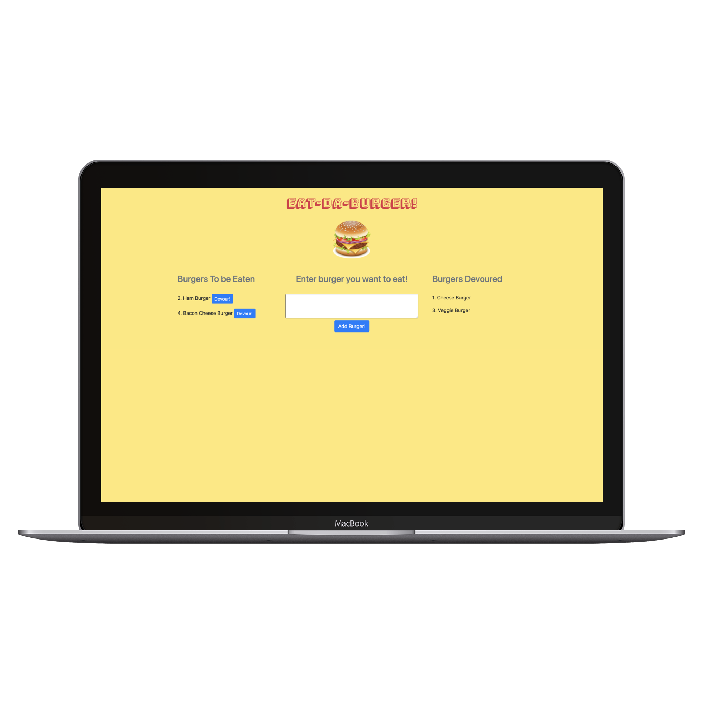

# Burger Logger

# Description :

Eat-Da-Burger restaurant app where the users input the names of burgers and has Devour button. When the user clicks it, the burger will be 'Devoured'. This full stack application created with MySQL, Node, Express, Handlebars and ORM.

## Deployed Website: 
[Burger Logger](https://eat-da-burger-restaurant.herokuapp.com/)

# Table of Contents

* [Technology](#technology)
* [Usage](#usage)
* [Features](#features)
* [License](#license)
* [Questions](#questions)

# Demo :

# Screenshot :

# Technology :

**1. [MySQL](https://www.npmjs.com/package/mysql)** : 
* MySQL is an open-source relational database management system.
* A relational database organizes data into one or more data tables in which data types may be related to each other; these relations help structure the data.
* SQL is used by language programmers to create, modify and extract data from the relational database, as well as control user access to the database.

**2. [Express.js](https://expressjs.com/)** :

* Web Applications : Express is a minimal and flexible Node.js web application framework that provides a robust set of features for web and mobile applications.

* APIs : With a myriad of HTTP utility methods and middleware, creating a robust API is quick and easy.

* Performance : Express provides a thin layer of fundamental web application features, without obscuring Node.js features.

**3. [Node.js](https://nodejs.org/en/)** : 

* Node.js is an open-source and cross-platform JavaScript runtime environment. 

* A Node.js app is run in a single process, without creating a new thread for every request. 

* Node.js provides a set of asynchronous I/O primitives in its standard library that prevent JavaScript code from blocking.

**4. [Handlebars.js](https://www.npmjs.com/package/handlebars)** :

* Fast execution: Handlebars compiles templates into JavaScript functions. This makes the template execution faster than most other template engines.

* Mustache-compatible: Handlebars is largely compatible with Mustache templates. In most cases it is possible to swap out Mustache with Handlebars and continue using your current templates.

* Semantic templates: Handlebars provides the power necessary to let you build semantic templates effectively.

# Usage :

1. 'Eat-Da-Burger!' is a restaurant app that lets users input the names of burgers they'd like to eat.

2. Whenever a user submits a burger's name, app will display the burger on the left side of the page -- waiting to be devoured.

3. Each burger in the waiting area also has a `Devour it!` button. When the user clicks it, the burger will move to the right side of the page as 'Devoured'.

4. App will store every burger in a database, whether devoured or not.

# Features :

1. Followed MVC(Model-View-Controller) design pattern.

2. Used Node and MySQL to query and route data.

3. Used handlebars.js to generate HTML pages.

4. App will store every burger in a database, whether devoured or not.

# License

This project is licensed under MIT license.

# Questions

If you have any questions about the repo, 
[open an issue](https://github.com/GauriKhandke/Burger-Logger/issues) 
or contact me directly at [Email](mailto:khandkegauri@gmail.com).

